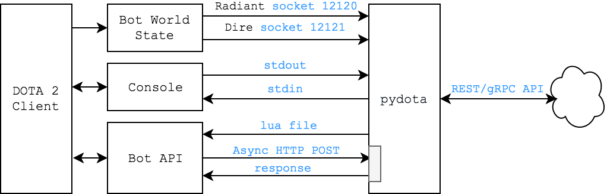

# WIP! PLZ COME BACK LATER

## Check out open sockets:

`$ lsof -n -i | grep -e LISTEN -e ESTABLISHED`
Result:
`dota2     1061 tzaman  215u  IPv4 0x84b2d9c103958a77      0t0  TCP *:12120 (LISTEN)`

## Dota has TensorFlow:

`cat Steam/steamapps/common/dota\ 2\ beta/game/dota/bin/linuxsteamrt64/libserver.so | grep -a tensorflow`
(...)
tf_server_client_connect_timeout_stf_server_client_read_timeout_stf_server_client_write_timeout_stf_server_stats_spew_interval_sdota_suggest_spew_pregame_itemsdota_suggest_spew_win_probabilitydota_suggest_spew_win_probability_chatdota_suggest_pregame_items_reductiondota_suggest_pregame_items_thresholddota_suggest_item_sequence_allow_thresholddota_suggest_item_sequence_threshold_startdota_suggest_item_sequence_threshold_fulldota_suggest_item_sequence_other_option_multiplierdota_suggest_item_sequence_dupe_multiplierdota_suggest_lane_trilane_penaltydota_suggest_win_probability_interval
(...)

## Mounting 

# Making the image

# Clear dangling images

docker rmi $(docker images -f dangling=true -q)

steamid ***REMOVED***
steampwd ***REMOVED***