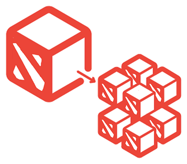
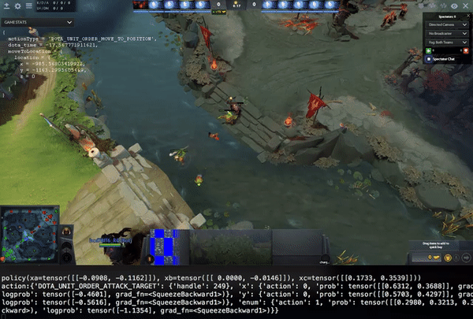
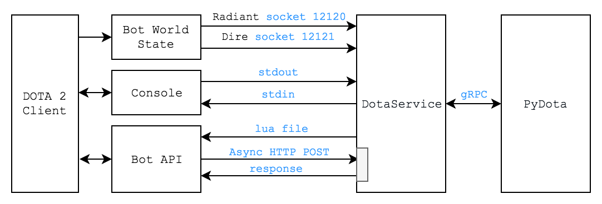

# DotaService



---

DotaService is a service to play Dota 2 through gRPC. There are first class python bindings
and examples, so you can play dota as you would use the OpenAI gym API.

It's fully functional and super lightweight. Starting Dota `obs = env.reset()` takes 5 seconds,
and each `obs = env.step(action)` in the environment takes between 10 and 30 ms.

You can even set the config of `render=True` and you can watch the game play live. Each game will
have a uuid and folder associated where there's a Dota demo (replay) and console logs.



## Run DotaService Locally

Run the DotaService so you can connect your client to it later. Only one client per server
is supported, and only one DotaService per VM (eg local or one per docker container).

```sh
python3 -m dotaservice
>>> Serving on 127.0.0.1:13337
```

## Run DotaService Distributed

See [docker/README.md](docker/README.md).

To run two dockerservice instances, one on port `13337` and one on `13338`, f.e. run:

```sh
docker run -dp 13337:13337 ds
docker run -dp 13338:13337 ds
```

You can run as many as you want, until you run out of ports or ip addresses. If you are wearing
your fancy pants, use Kubernetes to deploy gazillions.

## Client Code

```py
from grpclib.client import Channel
from protobuf.DotaService_grpc import DotaServiceStub
from protobuf.DotaService_pb2 import Action
from protobuf.DotaService_pb2 import Config

# Connect to the DotaService.
env = DotaServiceStub(Channel('127.0.0.1', 13337))

# Get the initial observation.
observation = await env.reset(Config())
for i in range(8):
    # Sample an action from the action protobuf
    action = Action.MoveToLocation(x=.., y=.., z=..)
    # Take an action, returning the resulting observation.
    observation = await env.step(action)
```

This is very useful to provide an environment for reinforcement learning, and service aspect of it makes it
especially useful for distributed training. I am planning to provide a client python
module for this (`PyDota`) that mimics typical OpenAI gym APIs. Maybe I won't even make PyDota
and the gRPC client is enough.

<div style="text-align:center">

</div>

### Requirements

* Python 3.7
* Unix: MacOS, Ubuntu. A dockerfile is also provided see: [docker/README.md](docker/README.md).

### Installation

Installing from pypi:
```sh
pip3 install dotaservice
```

For development; installing from source:
```sh
pip3 install -e .
```

(Optional) Compile the protos for Python (run from repository root):
```sh
python3 -m grpc_tools.protoc -I. --python_out=. --python_grpc_out=. --grpc_python_out=. dotaservice/protos/*.proto
```

### Benchmarks

From the benchmarks below you can derive that the dota service adds around 6±1 ms of time to
each action we take. Notice that Dota runs at a fixed (though not precise) 30 ticks/s.
When watching with `render=True` it seems that the bot is running faster than realtime even at
`host_timescale=1`. And below (auto-generated) metrics show that it's running faster than real time
too. Q: what's going on?

| `env.reset` (ms) | `env.step` (ms) | `host_timescale` | `ticks_per_observation` |
| ---              | ---             | ---              | ---                     |
| 5291             | 11              | 1                | 1                       |
| 5097             | 44              | 1                | 5                       |
| 5515             | 85              | 1                | 10                      |
| 5310             | 252             | 1                | 30                      |
| 5316             | 10              | 5                | 1                       |
| 5309             | 21              | 5                | 5                       |
| 5295             | 35              | 5                | 10                      |
| 5497             | 93              | 5                | 30                      |
| 5322             | 10              | 10               | 1                       |
| 5299             | 20              | 10               | 5                       |
| 5308             | 32              | 10               | 10                      |
| 5312             | 87              | 10               | 30                      |


# Notes

My dev notes: [NOTES.md](NOTES.md).

---

# Acknowledgements

* OpenAI Dota crew
* [Karpathy](http://karpathy.github.io/2016/05/31/rl/)
* Jan Ivanecky
* [Nostrademous](https://github.com/Nostrademous)
